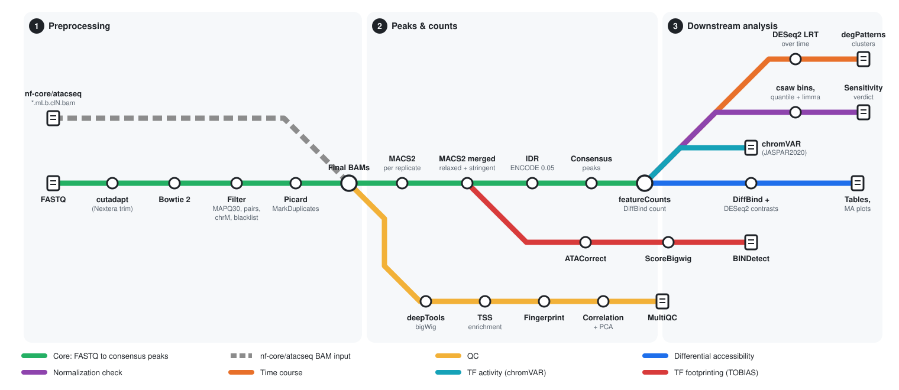

# mcbla-bulkatac-pipe

**From FASTQ to differential accessibility, TF activity and temporal programs
for stimulus and time-course ATAC designs, with benchmarked defaults. It picks
up where nf-core/atacseq stops.**

A Snakemake workflow for bulk ATAC-seq, written for the McBla lab (Salk
Institute). It is a port of the lab's production AS28 pipeline (MCF7 cells
stimulated with EGF or HRG, sampled from 0 to 240 min), generalised to any
design. Every default comes from that analysis and has the benchmark evidence
behind it written down in [`docs/defaults_rationale.md`](docs/defaults_rationale.md).

<picture>
  <source media="(prefers-color-scheme: dark)" srcset="docs/images/subway_map_dark.svg">
  
</picture>

## Why this pipeline, compared with nf-core/atacseq

nf-core/atacseq is a good pipeline for going from reads to filtered BAMs,
peaks and QC. This workflow can start from its output (`input_mode: nfcore`)
and adds the analysis layer that stimulus and time-course designs need.

| | nf-core/atacseq 2.x | mcbla-bulkatac-pipe |
|---|---|---|
| Trimming, alignment, filtering, dedup | yes (Trim Galore, BWA/Bowtie 2/Chromap/STAR) | yes (cutadapt Nextera, Bowtie 2), or reuses nf-core BAMs |
| Peak calling | MACS2 per library / merged replicate | MACS2 in four phases: per-replicate relaxed, merged relaxed (IDR oracle), merged stringent (production) |
| Reproducibility filtering | none (consensus by `bedtools merge` of peak calls) | IDR per condition (ENCODE threshold 0.05), any number of replicates |
| Consensus peak set | `bedtools merge` of all peaks | merge of IDR-reproducible peaks (or stringent union) |
| Differential accessibility | DESeq2 used for PCA and clustering only; no contrasts | DiffBind + DESeq2 on user contrasts, per-contrast tables, MA plots |
| Normalization comparison | no | same contrasts re-run under csaw background bins and quantile + limma; contrasts that move by >20% are flagged as normalization-sensitive |
| Time-course programs | no | DESeq2 LRT over time + DEGreport degPatterns clustering per treatment series |
| TF activity | no | chromVAR deviations (JASPAR2020 CORE vertebrates, GC-matched background) |
| TF footprinting | no | TOBIAS ATACorrect, ScoreBigwig, BINDetect across conditions |
| Defaults | general-purpose | benchmarked on a 22-library stimulus time course ([rationale](docs/defaults_rationale.md)) |

## Quickstart

### 0. Install the launcher

The repo's `pixi.toml` provides Snakemake (>= 8.20, tested on 9.27), the Slurm
and generic-cluster executor plugins, and conda. Bioinformatics tools are
pinned per stage in `workflow/envs/*.yaml` and are built by Snakemake
(`--sdm conda`). They are split by stage because the pinned versions do not
co-solve in one environment.

```bash
git clone https://github.com/bchick/mcbla-bulkatac-pipe.git && cd mcbla-bulkatac-pipe
pixi install
pixi run build-test     # synthetic test data (downloads chr22 + chrM from UCSC)
pixi run test           # align -> peaks -> IDR on the test data
```

### 1. Describe your samples

`config/samples.tsv` uses nf-core/atacseq's columns plus `condition`, and
optionally `treatment` and `time` for the time-course module:

```tsv
sample     fastq_1                  fastq_2                  replicate  condition  treatment  time
unstim_0m  US_r1_R1.fastq.gz        US_r1_R2.fastq.gz        1          unstim_0m  unstim     0
egf_30m    EGF30_r1_R1.fastq.gz     EGF30_r1_R2.fastq.gz     1          egf_30m    egf        30
```

* Libraries are named `<sample>_REP<replicate>`, the same as nf-core. Rows
  that share `sample` and `replicate` are sequencing runs of one library and
  are concatenated.
* `condition` groups replicates for merging, IDR and contrasts (it defaults
  to `sample`).
* `treatment` + `time` define time-course series. Treatments listed in
  `timecourse.baseline_treatments` (for example `unstim`) are a shared time-0
  baseline in every series.

Contrasts go in `config/contrasts.tsv`:

```tsv
group1   group2     label
egf_30m  unstim_0m  EGF_30m_vs_US
```

The shipped examples are the AS28 design: 11 conditions × 2 replicates and the
10 contrasts of the original analysis.

### 2a. From FASTQ

Edit `config/config.yaml` (every key is commented) and set at least
`reference.fasta`, `reference.bowtie2_index` (leave it empty to build one),
`reference.gtf`, `reference.blacklist` (leave it empty for none) and the
genome sizes. Then:

```bash
pixi run snakemake -n                                   # dry run
pixi run snakemake --profile profiles/slurm             # cluster (Slurm)
pixi run snakemake --profile profiles/local --cores 32  # one machine
```

`config/salk_example.yaml` is a filled-in version for GRCh38 on the lab
server (`--configfile config/salk_example.yaml`).

### 2b. From an nf-core/atacseq outdir

Run nf-core/atacseq 2.x as usual with the same samplesheet (the extra columns
are ignored there), then:

```yaml
input_mode: nfcore
nfcore:
  outdir: /path/to/nfcore/results
  aligner: auto                # finds bwa/, bowtie2/, chromap/ or star/
  use_merged_replicate: false  # true: use merged_replicate/*.mRp.clN.sorted.bam per condition
```

The filtered merged-library BAMs
`<aligner>/merged_library/<sample>_REP<n>.mLb.clN.sorted.bam` are linked into
`results/bam/`. Alignment and filtering are skipped and everything downstream
runs unchanged.

### 3. Choose analyses (optional)

By default the pipeline only processes the data: final BAMs, bigWigs, QC and
MultiQC, per-replicate and merged peaks, IDR, and two consensus peak sets.
`modules:` turns the processing steps `qc`, `multiqc` and `idr` on or off.

Each analysis runs only when you switch it on, and then you must say which
peak set it uses. There is no silent default:

```yaml
diff:        {run: true, peaks: individual}        # DiffBind contrasts (contrasts.tsv)
normcheck:   {run: true}                           # needs diff; reuses its counts
timecourse:  {run: true, peaks: idr_consensus}     # needs treatment + time columns
chromvar:    {run: true, peaks: idr_consensus}
footprint:   {run: true, peaks: stringent_union, conditions: [unstim_0m, egf_30m]}
```

| `peaks:` | Peak set |
|---|---|
| `idr_consensus` | `results/peaks/consensus/consensus_idr.bed`, merge of IDR-reproducible peaks per condition |
| `stringent_union` | `results/peaks/consensus/union_stringent.bed`, merge of merged-BAM `-q 0.05` peaks per condition |
| `individual` | diff only: DiffBind's own consensus of per-replicate relaxed peaks in ≥ `diff.min_overlap` libraries |
| a path to a BED file | any peak set (first three columns), e.g. one curated from an earlier run |

A peak set that's missing or invalid stops the run before any job starts.
`footprint.conditions` picks the conditions footprinted and compared by
BINDetect (empty means all). Analyses run on the processed outputs already
in `results/`, so switching one on later and re-running only computes that
analysis. `config/salk_example.yaml` switches on every analysis with the peak
sets AS28 used.

`exclude_conditions` keeps conditions (for example a failed batch) out of the
count-based statistics but leaves them in peaks and QC.

### Profiles

* `profiles/slurm/`: the primary cluster profile. Slurm is the only
  scheduler client installed on the lab server (no PBS/SGE). Fill in
  `slurm_partition` and `slurm_account`.
* `profiles/local/`: a single workstation.

## Outputs

See [`docs/outputs.md`](docs/outputs.md). The main files are:

| File | What it is |
|---|---|
| `results/bam/<lib>.final.bam` | filtered, deduplicated BAM (or a link to the nf-core BAM) |
| `results/qc/alignment_qc_report.tsv` | reads, alignment %, chrM %, blacklist, duplicates, fragment size |
| `results/qc/multiqc/multiqc_report.html` | MultiQC report |
| `results/peaks/merged_stringent/<cond>_peaks.narrowPeak` | production peaks per condition |
| `results/peaks/idr/idr_summary.tsv` | IDR peak counts and reproducibility per condition |
| `results/peaks/consensus/consensus_idr.bed` | consensus of IDR-reproducible peaks |
| `results/peaks/consensus/union_stringent.bed` | union of stringent peaks across conditions |
| *Analyses (opt-in):* | |
| `results/diff/depth/tables/<label>_{all,sig}.tsv` | differential accessibility per contrast |
| `results/normcheck/norm_verdict.tsv` | normalization-sensitive contrasts |
| `results/timecourse/<series>/degpatterns_clusters.tsv` | temporal cluster of each dynamic peak |
| `results/chromvar/deviation_zscores.tsv` | chromVAR TF deviation Z-scores |
| `results/footprint/bindetect/bindetect_results.txt` | TOBIAS differential TF binding |

## Testing

`.test/` holds a synthetic dataset: a 4 Mb window of chr22 plus chrM, with 9
runs across 4 conditions covering 1, 2 and 3 replicates and a replicate split
over two runs. It exercises the single-replicate IDR fallback, the multi-pair
IDR selection and FASTQ merging. `pixi run test` runs alignment → peaks →
IDR, and `pixi run test-all` runs everything, including the R and TOBIAS
environments. CI (`.github/workflows/ci.yml`) runs lint and dry runs in both
input modes. A real run of the test data can be started from the Actions tab
(`workflow_dispatch`).

## Known gaps

* IDR for more than two replicates uses the maximum over true-replicate pairs.
  There are no pseudo-replicates, so no ENCODE "optimal" set and no
  rescue/self-consistency ratios.
* ROCCO all-sample consensus (the benchmark's choice for a union peak set) is
  not included yet.
* Paired-end only. Single-end ATAC is not supported.
* The nf-core import has been checked against the documented 2.x layout
  (`<aligner>/merged_library/*.mLb.clN.sorted.bam`,
  `<aligner>/merged_replicate/*.mRp.clN.sorted.bam`), not yet against a real
  nf-core run.

## Citation

If you use this workflow, please cite it (see `CITATION.cff`) and the tools
it runs:

* Snakemake: Mölder et al. 2021, *F1000Research* 10:33
* cutadapt: Martin 2011, *EMBnet.journal* 17:10
* Bowtie 2: Langmead & Salzberg 2012, *Nat Methods* 9:357
* SAMtools: Danecek et al. 2021, *GigaScience* 10:giab008
* BEDTools: Quinlan & Hall 2010, *Bioinformatics* 26:841
* MACS2: Zhang et al. 2008, *Genome Biol* 9:R137
* IDR: Li et al. 2011, *Ann Appl Stat* 5:1752
* deepTools: Ramírez et al. 2016, *Nucleic Acids Res* 44:W160
* MultiQC: Ewels et al. 2016, *Bioinformatics* 32:3047
* DiffBind: Ross-Innes et al. 2012, *Nature* 481:389
* DESeq2: Love et al. 2014, *Genome Biol* 15:550
* csaw: Lun & Smyth 2016, *Nucleic Acids Res* 44:e45
* limma: Ritchie et al. 2015, *Nucleic Acids Res* 43:e47
* DEGreport: Pantano 2019, Bioconductor package DEGreport
* chromVAR: Schep et al. 2017, *Nat Methods* 14:975
* JASPAR 2020: Fornes et al. 2020, *Nucleic Acids Res* 48:D87
* TOBIAS: Bentsen et al. 2020, *Nat Commun* 11:4267
* ENCODE blacklist: Amemiya et al. 2019, *Sci Rep* 9:9354

## License

MIT, see [`LICENSE`](LICENSE). Written by Brent Chick.
